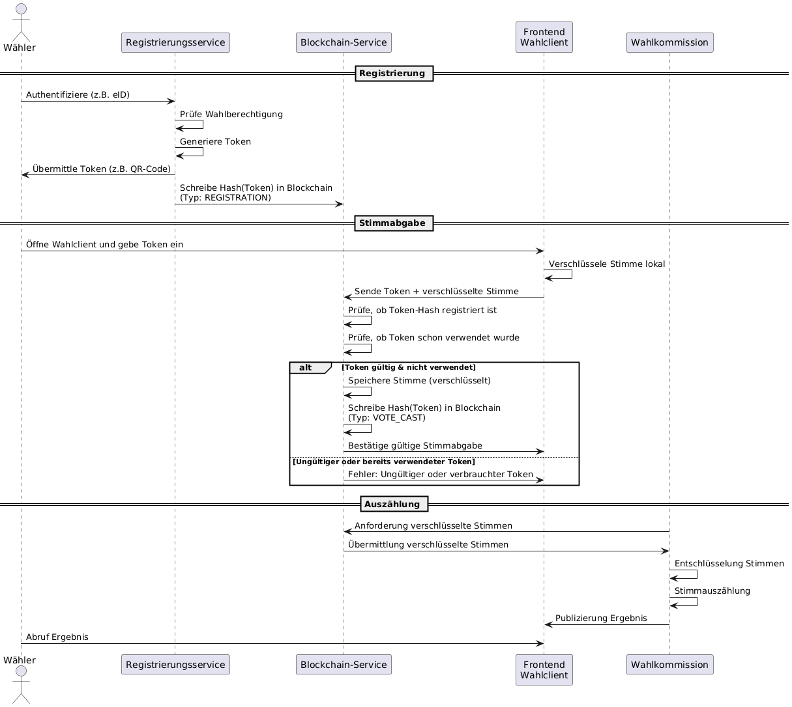

# 1. Zielsetzung
Ein sicheres, datenschutzkonformes und nachvollziehbares Online-Wahlsystem für Parlamentswahlen (Bundestag, Landtag etc), das:
- nur registrierten Wählern die Stimmabgabe ermöglicht,
- die Anonymität der Stimme garantiert,
- wesentliche Wahlvorgänge revisionssicher dokumentiert (Blockchain),
- die Stimmen automatisiert nach Wahlschluss auszählt und dem Wahlleiter meldet,
- den Anforderungen des Bundeswahlgesetzes entspricht.

## Anforderungen

### Authentifizierung und Anonymität
Für eine demokratische Wahl muss gewährleistet werden, dass nur berechtigte Wählerinnen ihre Stimme abgeben können und dass jeder Berechtigte die gleiche Anzahl von Stimmen hat. Gleichzeitig muss die Anonymität der abgegebenen Stimmen gewahrt bleiben. 

Zu den Anforderungen im Hinblick auf die Integrität einer Online-Wahl gehört, dass das Wahlergebnis abschließend überprüft werden muss. Diese Anforderung wird End-To-End Verifiability (E2E-V) genannt.

Die Ziele einer Verifizierung einer Wahl lauten: 
- Auswahl wie vorgesehen;
- registriert wie gewählt und
- gezählt wie registriert.” 

Das bedeutet, dass überprüfbar sein muss:
1. Wurde der beabsichtigte Kandidat gewählt? Wenn beispielsweise die Kandidaten auf den Listen vertauscht würden, könnte ein Wähler unbeabsichtigt die falsche Wahl treffen.
2. Wurde die Stimme so übermittelt und gespeichert, wie gewählt? Durch Manipulationen bei der Übermittlung oder Speicherung können bei einem Online-Wahlsystem Stimmen verloren gehen, oder doppelt gespeichert werden.
3. wurde die Stimme auch so gewertet wie gespeichert?

### Geheimhaltung und Mechanismus gegen Erpressungen
Ein Online-Wahlsystem muss eine geheime Wahl garantieren. Da eine Online-Wahl unter „unkontrollierten“ Bedingungen stattfindet (nicht im Wahllokal sondern zuhause auf unsicheren Endgeräten), muss außerdem sichergestellt werden, dass kein massenhafter Stimmenkauf, Erpressung etc. technisch ermöglicht wird, ohne dass dies entdeckt wird. Das bedeutet, dass das System beispielsweise nicht offenbaren darf, wie ein bestimmter Wähler gewählt hat. Eine Umsetzung dieser Anforderung bedarf letztendlich eines Identitäts-Managements, das jedoch getrennt werden muss von der Stimmenabgabe (wie die Wahlkabine in einem Wahllokal bei einer konventionellen Wahl)

Das Problem der potentiellen Erpressbarkeit erweitert die Anforderung der bloßen Geheimhaltung: Die Gefahr, dass Stimmen gekauft oder erpresst werden, lässt sich nur verhindern, wenn eine Wählerin nicht die Möglichkeit hat, zu beweisen, wie sie gewählt
hat. Wäre sie dazu in der Lage, könnte ein Erpresser diesen Beleg fordern und sie wäre erpressbar. Eine Anforderung, die deswegen an elektronische Wahlsysteme gestellt wird, wird in der Literatur als „Coercion resistance“ - zu Deutsch etwa „Widerstandsfähigkeit gegen Erpressung“ bezeichnet. Ein möglicher Erpresser darf außerdem auch ohne Kooperation der Wählerin keine Möglichkeit haben, eine Verbindung zwischen der Wählerin und ihrer Wahlentscheidung herstellen können dürfen. Um die Anforderungen betreffs der Geheimhaltung und Widerstandsfähigkeit zu erfüllen, ist es notwendig, die Wahlentscheidungen bei der Übertragung in die Blockchain so zu verschlüsseln, dass ein Erpresser keine Möglichkeit hat, vom Opfer oder dem Computer des Opfers einen Schlüssel zur Entschlüsselung der Daten zu bekommen, um Kenntnis über die tatsächliche Wahlentscheidung der Wählerin zu erlangen – sei es mit oder ohne Kooperation der Wählerin.

# 2. Systemkomponenten (Architekturübersicht)

## A. Frontend

Plattformen: Web & Mobile

Funktionen:
- Authentifizierung
- Anzeige des Wahlzettels
- Stimmabgabe und Verschlüsselung
- Bestätigung (anonymisiert)

## B. Backend
- Microservice-Architektur, containerisiert (z.B. Docker/Kubernetes)
- Wichtige Services:
    - <b>Registrierungsservice</b>: Prüft Wahlberechtigung und erstellt verschlüsseltes Token für Wahlsystem
    - <b>Wählerauthentifizierung</b>: Bindet z.B. eID, Personalausweis mit Online-Funktion oder ELSTER-Zertifikat ein
    - <b>Stimmabgabe-Service</b>: Nimmt Stimme entgegen
    - <b>Blockchain-Service</b>: Persistiert Wahlereignisse (Registrierung, Token-Ausgabe, Stimmabgabe, Speichern der verschlüsselten Stimme
    - <b>Zähldienst</b>: Führt nach Wahlschluss automatisiert die Auszählung durch
    - <b>Meldedienst</b>: Übermittelt Ergebnis mit Prüfsummen an den Wahlleiter
  
## C. Blockchain-Komponente
- <b>Permissioned Blockchain</b> (z.B. Hyperledger Fabric oder Quorum)
- <b>Knoten</b>: Wahlkommission, Parteien, neutrale Beobachter
- <b>Einträge</b>: Registrierungen (Hash), Stimmabgaben (anonym, nur Token + Zeitstempel), Zähl-Ergebnisse, Ereignisprotokolle

## 3. Wahlprozess (End-to-End)
1. Registrierung

    Nutzer authentifiziert sich mit amtlichem Ausweisdokument

    Prüfung durch Registrierungsservice (Anbindung an Melderegister)

    Token-Ausgabe an den Nutzer (wird später zur Stimmabgabe benötigt)

    Registrierung auf Blockchain protokolliert (nur Hash des Tokens)

2. Stimmabgabe

    Nutzer meldet sich mit Token im Frontend an

    Stimme wird lokal im Browser verschlüsselt (Ende-zu-Ende)

    Stimme (anonym) und Token (signiert) werden ans Backend gesendet

    Token wird entwertet (keine Mehrfachabgabe möglich)

    Blockchain: Eintrag mit Zeitstempel, Token-Hash, Transaktions-ID

3. Auszählung & Ergebnisübermittlung

    Nach Wahlschluss: Stimmen werden durch den Zähldienst aggregiert

    Validierung gegen Blockchain (nur gültige, nicht doppelte Tokens)

    Ergebnis + Blockchain-Verweis an Wahlleiter übermittelt

    Ergebnisse öffentlich einsehbar über ein Dashboard (verifiziert über Blockchain)
   

Abbildung 1: Sequenzdiagramm BVS Wahl



# 3. Entwicklung von Prototypen

Für das BVS werden verschiedene Applikationen benötigt, die jeweils die Funktionalitäten für die jeweiligen Rollen bei einer Wahl abdecken. Als erstes wird ein Web3-basiertes Frontend entwickelt, mit der die Funktionalitäten für die Rolle Wähler/-in getestet werden kann. Als Basis dient dabei eine Node.js (Javascript) Laufzeit-Umgebung mit React-Frontend und als Blockchain-Backend "Quorum", auf Basis von Ethereum. das dApps (Verteilte Anwendungen) und SmartContracts unterstützt.
Dazu werden ein Registrierungsservice mit Verbindung zum Melderegister/Wahlamt und ein Wahlleiter (bzw. Wahlkommission) benötigt.

## 🗳️ Smart Contract: Election.sol (contracts/Election.sol)

Dieser Solidity-Vertrag ermöglicht:

- Registrierung von Kandidaten und Wählern durch den Admin
- Starten und Beenden der Wahl
- Abgabe von Stimmen durch registrierte Wähler
- Ermittlung des Wahlsiegers nach Beendigung der Wahl


## UI-Frontend für Quorum mit React + ether.js.

Das Frontend (FE) ist ein einfaches, aber funktionales React + ethers.js UI-Frontend zur Interaktion mit den Smart Contracts auf Quorum. Es ermöglicht in der Testversion:

- Registrierung als Online-Wähler
- Abgabe einer verschlüsselten Stimme
- Abruf und Anzeige der Wahlergebnisse
    
In der Produktiv-Version gibt es natürlich verschiedene Frontends für die jeweiligen Rollen: Wähler, Wahlleiter etc.

### Dateistruktur

    frontend/
    ├── src/
    │   ├── components/
    |   |   |── RegistrationForm.js
    │   │   ├── VoteForm.js
    │   │   ├── Results.js
    │   ├── App.js
    │   ├── index.js
    ├── package.json


### Registrierungsservice 

Der Registrierungsservice besteht zunächst der Einfachheit halber aus MySQL-Datenbank und Node.js (Javascript) Laufzeit-Umgebung mit React-Frontend, die einen Token-Hash in die Blockchain schreibt. Nach der erfolgreichen Authentifizierung und Registrierung als Online-Wähler erhält der Wähler einen Token z.B. als QR-Code. Ein Hash dieses Tokens wird in der Blockchain gespeichert. 

```
Token-Hash = SHA-256(Token)
    Blockchain-Eintrag: {
        type: "REGISTRATION",
        hash: <Token-Hash>,
        timestamp: <Zeit>,
        nonce: ...
    }
```


Dadurch wird die Geheimhaltung bei der Wahl gewährleistet, denn es ist nahezu unmöglich, diesen Token-Hash zum Token zurück zu entwickeln und mit einem bestimmten Wähler zu verbinden. 

Der Token wird wieder gebraucht, wenn der Wähler seine Stimme abgibt. Dann wird wieder ein Hash des Tokens erzeugt und mit dem gespeichertem Hash in der Blockchain verglichen.

### Wahlvorgang / Stimmabgabe

(UI-Frontend)

Stimmabgabe-Transaktion (VOTE):

    {
      "type": "VOTE",
      "encrypted_vote": "g2k14ab2==...==q9xz",  // Base64-encoded ciphertext
      "token_hash": "a4c67f2f82e14361df61d6fe7ef7cd228b3d3d2e8bc048ef278d4fa4a9b2e13c",
      "timestamp": "2025-09-22T11:03:12Z",
      "signature": "0xa91bc9a...47d",  // Optional (z. B. für Node-Signatur)
      "metadata": {
        "submitted_by": "vote-node-4"
      }
    }


- Nur eine VOTE-Transaktion pro token_hash ist erlaubt → Verhinderung von Mehrfachabgaben

- encrypted_vote enthält die mit dem öffentlichen Schlüssel verschlüsselte Stimme (z. B. "Partei X")


### Auszählung / Veröffentlichung des Wahlergebnisses (TALLY)

Nach Wahlschluss erstellt ein Zähldienst ein signiertes Ergebnis.
Beispiel-Transaktion:

    {
      "type": "TALLY",
      "results": {
        "Partei A": 142345,
        "Partei B": 130222,
        "Partei C": 53421
      },
      "counted_votes": 325988,
      "timestamp": "2025-09-23T18:00:00Z",
      "signature": "0xd4cf34d...aa1"
    }

- Optional könnten auch Merkle-Roots der gezählten Stimmen beigefügt werden
- Die Entschlüsselung der Stimmen erfolgt lokal, nicht on-chain

✅ Blockchain-Validierungslogik (vereinfacht)

    def validate_vote_submission(token_hash, blockchain):
        # Prüfe, ob der Token-Hash registriert wurde
        registered = any(tx for tx in blockchain if tx["type"] == "REGISTRATION" and tx["token_hash"] == token_hash)

        # Prüfe, ob für diesen Hash bereits gewählt wurde
        already_voted = any(tx for tx in blockchain if tx["type"] == "VOTE" and tx["token_hash"] == token_hash)

        if not registered:
            raise Exception("Unbekannter Token")
        if already_voted:
            raise Exception("Token bereits verwendet")

        return True


# 4 Installation (Prototyp)
🔧 Voraussetzungen

Bevor du beginnst, stelle sicher, dass folgende Tools installiert sind:

    Node.js (LTS)

    npm

    Git

    Docker & Docker Compose

    MetaMask Browser Extension

## 4.1. 📦 Quorum-Netzwerk aufsetzen
   
	$ git clone https://github.com/luzi41/BlockchainVotingSystem.git && cd BlockchainVotingSystem // ⚠️ wenn Struktur noch nicht vorhanden
       
        $ cd election-system
        $ npx quorum-dev-quickstart
       
### Fragen:

    Which Ethereum client would you like to run? Default: [1]
    	1. Hyperledger Besu
    	2. GoQuorum

     2

    Do you wish to enable support for logging with Loki, Splunk or ELK (Elasticsearch, Logstash & Kibana)? Default: [1]
	    1. Loki
	    2. Splunk
	    3. ELK
    3

    Weitere: Standard

### 1.1 Netzwerk starten (z.B. mit Raft)

    cd quorum-test-network
    ./run.sh
    cd ..

Dadurch wird im Verzeichnis quorum-test-network/ ein vollständiges Netzwerk mit mehreren Nodes erzeugt.

## 4.2. 🛠 Smart Contract deployen

## 4.2.1 Hardhat Projekt installieren und initialisieren (wenn noch nicht vorhanden!)

im Verzeichnis election-system

npm init
npm install --save-dev hardhat
npx hardhat init

Antworten:

Typ: "Create a basic sample project"

Sprache: "JavaScript"

Weitere: Standard/Yes


### 4.2.3 SmartContract kompilieren

im Verzeichnis election-system

    cd contracts && npx hardhat compile

### 4.2.4 Konfiguration anpassen (hardhat.config.js)

im Verzeichnis election-system
💡 Den Account ersetzt du ggf. mit passenden privaten Keys oder Encrypted Keystore des Accounts Member1 aus quorum-test-network/config/nodes/Member1/accountPivateKey.txt. (das Netzwerk muss gestartet sein).


	require("@nomicfoundation/hardhat-toolbox");
	module.exports = {
	solidity: "0.8.28",
	  networks: {
	    quorum: {
	      url: "http://localhost:8545",
	      accounts: {
	        "0x8bbbb1b345af56b560a5b20bd4b0ed1cd8cc9958a16262bc75118453cb546df7"
	      }
	    }
	  }
	};


### 4.2.5 Contract deployen

im Verzeichnis election-system

     npx hardhat run scripts/deployElection.js --network quorum > api/deployment-address.txt


## 4.3. Backend-API

### 4.3.1 API vorbereiten

Speichere das ABI:
im Verzeichnis election-system

    cp artifacts/contracts/Election.sol/Election.json api/Election.json

Stelle sicher, dass in api/deployment-address.txt die richtige Contract-Adresse steht.

### 4.3.2 API starten

im Verzeichnis election-system

    cd api
    npm install express ethers // wenn noch nicht geschehen
    node index.js

## 4.4. 🖥 Frontend starten

### 4.4.1 React-App erstellen, falls noch nicht geschehen

Öffne ein neues Terminalfenster im Verzeichnis election-system:
  
     cd frontend && $npm install
  
in src/config.js die richtige Contract-Adresse einfügen (aus api/deployment-address.txt).

### 4.4.2 Komponenten einfügen

Füge die Komponenten VoteForm.js, Results.js, App.js wie oben beschrieben unter src/components ein.

### 4.4.3 ABI kopieren

im Verzeichnis election-system/frontend

    cp  -R ../artifacts src/


## 4.5. 🗳 Admin-Konfiguration & Wahlprozess

### 4.5.1 Wähler & Kandidaten registrieren

- Öffne ein neues Terminalfenster:

- Verwende die API:

      curl -X POST http://localhost:3001/registerCandidate -H "Content-Type: application/json" -d '{"name": "Alice"}' &&
      curl -X POST http://localhost:3001/registerCandidate -H "Content-Type: application/json" -d '{"name": "Bob"}' &&
      curl -X POST http://localhost:3001/registerCandidate -H "Content-Type: application/json" -d '{"name": "Charly"}' &&
      curl -X POST http://localhost:3001/registerCandidate -H "Content-Type: application/json" -d '{"name": "Denise"}' &&
      curl -X POST http://localhost:3001/registerCandidate -H "Content-Type: application/json" -d '{"name": "Emily"}' &&
      curl -X POST http://localhost:3001/registerToken -H "Content-Type: application/json" -d '{"token" : "SecretToken1"}' &&
      curl -X POST http://localhost:3001/registerToken -H "Content-Type: application/json" -d '{"token" : "SecretToken2"}' &&
      curl -X POST http://localhost:3001/registerToken -H "Content-Type: application/json" -d '{"token" : "SecretToken3"}' &&
      curl -X POST http://localhost:3001/registerToken -H "Content-Type: application/json" -d '{"token" : "SecretToken4"}' &&
      curl -X POST http://localhost:3001/registerToken -H "Content-Type: application/json" -d '{"token" : "SecretToken5"}' &&
      curl -X POST http://localhost:3001/registerToken -H "Content-Type: application/json" -d '{"token" : "SecretToken6"}' &&
      curl -X POST http://localhost:3001/registerToken -H "Content-Type: application/json" -d '{"token" : "SecretToken7"}' &&
      curl -X POST http://localhost:3001/registerToken -H "Content-Type: application/json" -d '{"token" : "SecretToken8"}' &&
      curl -X POST http://localhost:3001/startVoting -H "Content-Type: application/json" -d '{"title" : "Wahl 2025"}'

### 4.5.2 Frontend starten

im Verzeichnis election-system/frontend    

    npm start

## 4.6. 🧑‍💻 Abstimmung durchführen

- Öffne das React-Frontend im Browser (http://localhost:3002)
- MetaMask verbinden
- Kandidat auswählen & abstimmen

## 4.7. 🏁 Wahl beenden & Ergebnisse anzeigen

### 4.7.1 Wahl beenden

    curl -X POST http://localhost:3001/endVoting

### 4.7.2 Ergebnisse im Browser sehen

Navigiere zu http://localhost:3002/results

## 4.8. Fehlerquellen

Mögliche Fehlerquellen beim Kompilieren der SmartContracts und Ausführen der Scripte sind:

- Falscher Zeichensatz,
- alte Keys in den Scriptdateien,
- beim mehrfachen Verwenden des API: Prompt nicht sauber - führt zu ungültigen Eingaben. Abhilfe: nach jeder Eingabe 'Enter' doppelt betätigen.

# 5. ToDo

- Verschlüsselung der Stimmabgabe
- ZK-Proof 
