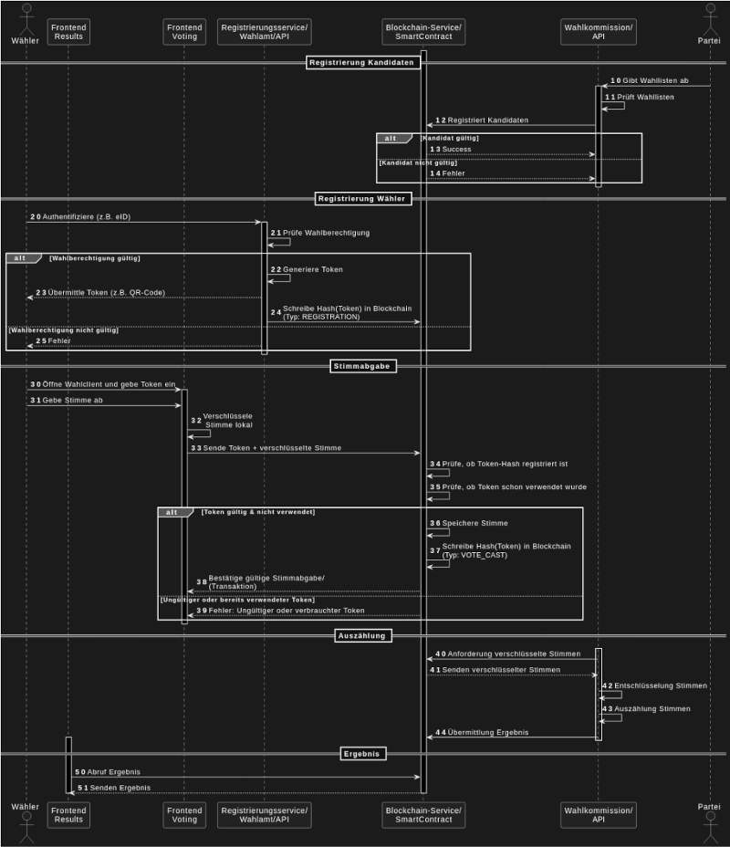

#  Blockchain Voting System
The motivation for developing a new system for conducting online elections and surveys lies in the advantages such a system offers, provided transparency, security, and organizational issues are satisfactorily resolved:
1. New opportunities for democratic participation, thus increasing political influence
2. Voters can vote from any time and location, increasing voter turnout
3. Long-term reduction in election costs

The second point (voters' independence from time and place) seems particularly crucial to me; this function has so far been represented in conventional elections primarily by the option of postal voting. Using an online voting system could make elections possible even in places where conventional elections can only be held under very difficult conditions. The advantages of independence from time and place would be particularly evident in countries with weak infrastructure or in countries suffering from civil war or terrorism, since it is precisely in places where there is a weak or destroyed infrastructure that mobile internet use is already widespread among all segments of the population and is growing faster than in developed industrialized countries.

# 1. Objectives 

A secure, privacy-compliant and traceable online voting system for surveys and elections that: 
- allows only registered voters to cast their votes,
- guarantees the anonymity of the vote,
- documents essential election processes in an audit-proof manner (blockchain),
- automatically counts the votes after the polls close and reports them to the returning officer,
- complies with the requirements of the Federal Elections Act.

## 1.2. Requirements 

Authentication and anonymity For a democratic election, it must be ensured that only eligible voters can cast their votes and that each eligible voter has the same number of votes. At the same time, the anonymity of the votes cast must be preserved. One of the requirements for the integrity of an online election is that the election result must be conclusively verified. This requirement is called End-To-End Verifiability (E2E-V). The objectives of a verification of an election are: Selection as intended; registered as selected and counted as registered. 
This means that it must be verifiable:

- Has the intended candidate been elected? For example, if the candidates on the lists were swapped, a voter could unintentionally make the wrong choice.
- Was the vote transmitted and stored as elected? Due to manipulation in transmission or storage, votes can be lost or stored twice in an online voting system.
- Was the vote also counted as it was stored?

## 1.3 Secrecy and mechanism against extortion 

An online voting system must guarantee a secret ballot. Since an online election takes place under "uncontrolled" conditions (not at the polling station but at home on insecure devices), it must also be ensured that no mass vote buying, blackmail, etc. is technically possible without this being discovered. This means that the system is not allowed to reveal, for example, how a particular voter voted. Implementation of this requirement ultimately requires identity management, which must be separated from the casting of votes (like the polling booth in a polling station in a conventional election).
The problem of potential blackmail extends the requirement of mere secrecy: the danger of votes being bought or blackmailed can only be prevented if a voter does not have the opportunity to prove how she voted. If she were able to do so, a blackmailer could demand this receipt and she would be susceptible to blackmail. A requirement that is therefore placed on electronic voting systems is referred to in the literature as "coercion resistance". In addition, a possible blackmailer must not have the opportunity to establish a connection between the voter and her voting decision, even without the cooperation of the voter. In order to meet the requirements of secrecy and resilience, it is necessary to encrypt voting decisions when they are transferred to the blockchain in such a way that the blackmailer has no possibility of obtaining a key from the victim or the victim's computer to decrypt the data in order to gain knowledge of the voter's actual voting decision – whether with or without the cooperation of the voter.

# 2. System Components (Architecture Overview)

## A Frontend

Platforms: Web, Desktop & Mobile 
Functions: 
- Authentication
- Display of the ballot paper
- Voting and encryption Confirmation (anonymized)

## B. Backend

- Microservice architecture, containerized (e.g. Docker/Kubernetes)
- Key services:
  - Registration service: verifies eligibility to vote and creates encrypted token for voting system
  - Voter authentication: Integrates e.g. eID, ID card with online function or ELSTER certificate
  - Voting Service: Accepts Vote
  - Blockchain service: Persists election events (registration, token issuance, voting, storing the encrypted vote)
  - Counting service: Automatically carries out the counting after the polls close
  - Reporting service: Transmits result with checksums to the returning officer

## C Blockchain component 

- Permissioned blockchain (e.g. Hyperledger Fabric or Quorum)
- Nodes: Electoral Commission, Parties, Neutral Observers
- Entries: registrations (hash),
- votes cast (anonymous, tokens + timestamps only),
- counting results,
- event logs

# 3. Electoral process (End-to-End)

## 3.1 Registration

- User authenticates with official ID document
- Verification by registration service (connection to population register)
- Token issuance to the user (will be needed later to vote)
- Registration logged on blockchain (only hash of the token)

## 3.2 Voting

- User logs in with token in the frontend
- Voice is encrypted locally in the browser (end-to-end)
- Vote (anonymous) and token (signed) are sent to the backend
- Token will be cancelled (no multiple submission possible)
- Blockchain: Entry with timestamp, token hash, transaction ID

## 3.3 Counting & Transmission of Results

- After the polls close: votes are aggregated by the counting service
- Validation against blockchain (only valid, not duplicate tokens)
- Result + blockchain reference transmitted to election officer

## 3.4 Results

- Results publicly viewable via a dashboard (verified via blockchain)

# 4. Installation development version of BVS

go to: [doc/installation and configuration](./doc/installation%20and%20Configuration)

# 5. Todo

- Election templates: different kinds of elections and surveys (V 1.0)
